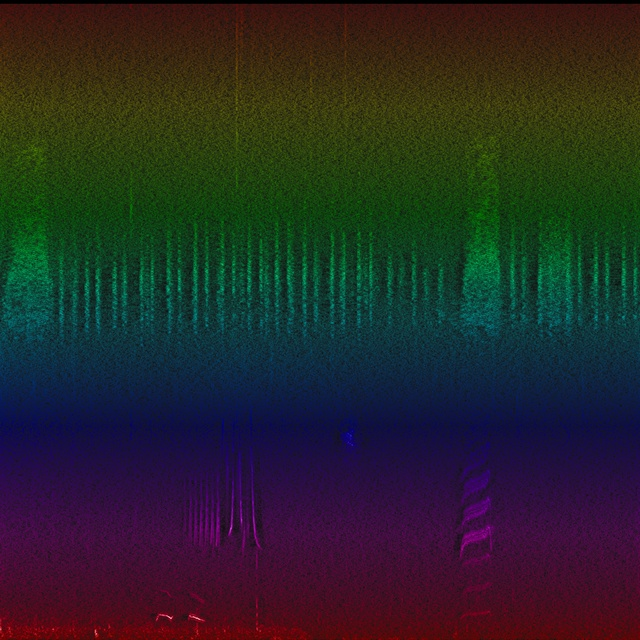
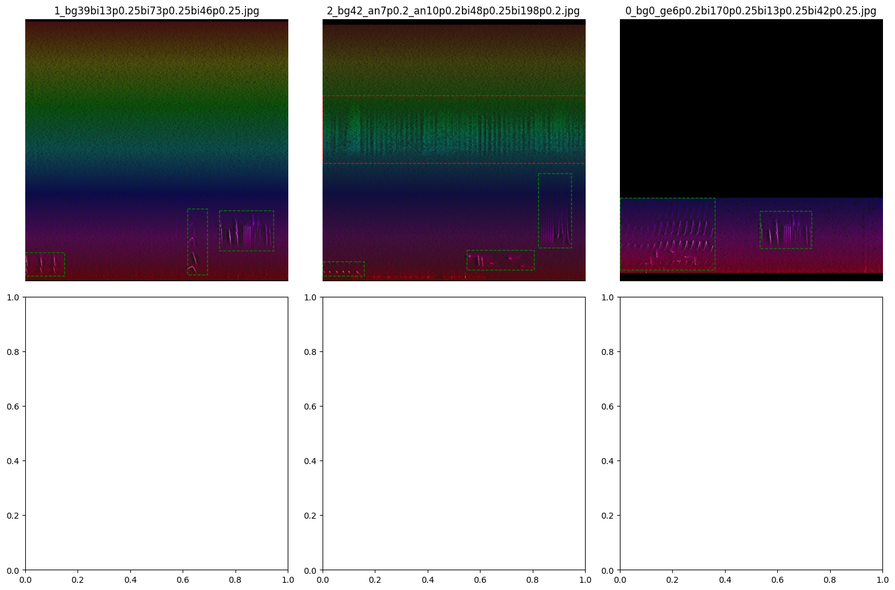

# bioacoustic detector tool
finetuned yolov8 box detector.
draws bounding boxes around animal sounds, distinguishes between vocalisations with constant frequency profile (crickets thrumming, continuous single bird >10 seconds, etc) and transient vocalisations.
training dataset augmentation. datasets not included here.

training data examples

